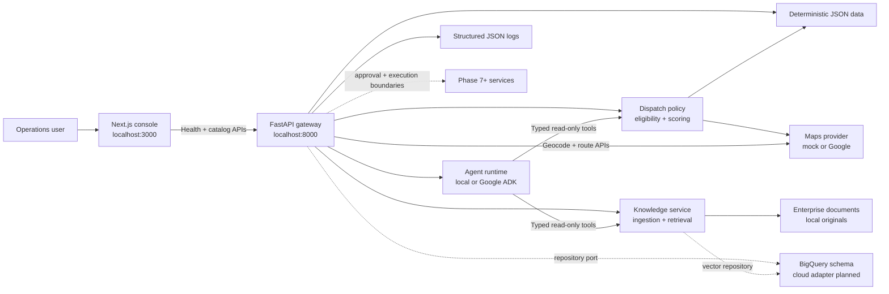

# GeoOps AI

GeoOps AI is a geospatial AI operations platform for field-service teams. The planned system combines structured operational data, geospatial reasoning, enterprise knowledge retrieval, typed agent tools, human approval, asynchronous dispatch, and reproducible evaluation.

The current implementation includes the platform foundation, domain/data catalog, deterministic dispatch, maps, knowledge retrieval, and Phase 6 agent orchestration. The agent uses typed read-only tools and returns inspectable evidence; it does not display invented performance metrics or execute operational mutations.

## Current capabilities

- Responsive and accessible operations console
- Live browser-to-API health verification with loading, error, retry, and success states
- Searchable and filterable ticket and technician catalogs with detail views
- Typed customer, site, ticket, assignment, certification, SLA, approval, agent, evaluation, and knowledge entities
- Deterministic seed data with dispatch edge cases and referential-integrity tests
- Storage-neutral repository boundary with a local JSON implementation
- BigQuery DDL with practical partitioning and clustering
- Deterministic dispatch eligibility gates with ranked, inspectable score breakdowns
- Provider-neutral geocoding, route, and route-matrix APIs
- Key-free deterministic maps adapter plus an opt-in Google Maps adapter
- Route-duration evidence and explicit routing failures in dispatch results
- Local document storage, heading-aware ingestion, and deterministic embeddings
- Metadata-filtered knowledge search with ranked source passages and citations
- Typed read-only agent tools for tickets, technicians, dispatch recommendations, and knowledge
- Provider-neutral agent runtime with key-free local orchestration and Google ADK adapters
- Safe agent evidence including tool names, citations, route results, and correlation identifiers
- BigQuery `VECTOR_SEARCH` query and vector-index definitions
- Typed, deterministic `GET /health` API contract and generated OpenAPI documentation
- Validated environment configuration with safe local defaults
- Configurable CORS for local browser access
- Correlation IDs and structured JSON request logs
- pnpm and uv workspaces with committed lockfiles
- Unit tests, linting, strict type checking, and optimized builds
- Development and deployable container targets

## Architecture



The browser calls the API directly, exercising the real cross-origin application boundary. Application services depend on repository, maps, storage, and embedding protocols rather than vendor SDKs. Local mode uses a deterministic JSON snapshot, reproducible route estimates, filesystem documents, and key-free embeddings. Google Maps and BigQuery assets remain opt-in cloud paths.

## Repository layout

```text
.
├── apps/
│   ├── api/              # FastAPI package, tests, and container
│   └── web/              # Next.js application, tests, and container
├── data/
│   ├── seed/             # Deterministic operational snapshot
│   ├── documents/        # Versioned enterprise knowledge originals
│   └── schema/           # BigQuery DDL migrations
├── .env.example          # Canonical local configuration contract
├── docker-compose.yml    # Hot-reloading local container stack
├── Makefile              # Developer workflow
├── package.json          # pnpm orchestration scripts
├── pnpm-workspace.yaml
└── pyproject.toml        # uv workspace and Python tooling
```

Worker, agent, evaluation, and infrastructure directories will be introduced only when their implementation phase begins.

## Prerequisites

- Node.js 22 or newer; Node 24 LTS is the container baseline
- pnpm 10.29.3
- Python 3.13
- [uv](https://docs.astral.sh/uv/)
- GNU Make or a compatible `make`
- Docker with Compose v2 only if using the container workflow

## Local setup

```bash
cp .env.example .env
make setup
make seed
make knowledge
make dev
```

Open:

- Web console: <http://localhost:3000>
- API health: <http://localhost:8000/health>
- OpenAPI documentation: <http://localhost:8000/docs>

`make dev` runs both applications with hot reload. Use `Ctrl+C` once to stop both processes.

If `make` is unavailable, run the underlying cross-platform commands directly:

```bash
pnpm install
uv sync --all-packages
uv run --package geoops-api python -m geoops_api.seed
pnpm dev
```

Run either application independently with:

```bash
make web
make api
```

## Configuration

| Variable | Default | Purpose |
| --- | --- | --- |
| `APP_ENV` | `development` | API environment label returned by `/health` |
| `LOG_LEVEL` | `INFO` | Python structured-log threshold |
| `CORS_ORIGINS` | Local web origins | JSON array of allowed browser origins |
| `HOST` | `0.0.0.0` | API bind host for local tooling and containers |
| `PORT` | `8000` | API port |
| `SEED_DATA_PATH` | `data/seed/geoops_seed.json` | Local operational dataset |
| `MAPS_PROVIDER` | `mock` | Maps adapter: `mock` or `google` |
| `GOOGLE_MAPS_API_KEY` | unset | Server-only key required when `MAPS_PROVIDER=google` |
| `MAPS_TIMEOUT_SECONDS` | `10` | Outbound maps request timeout, greater than 0 and at most 60 seconds |
| `KNOWLEDGE_DOCUMENTS_PATH` | `data/documents` | Local source-document root |
| `EMBEDDING_DIMENSIONS` | `256` | Deterministic local embedding dimensions |
| `KNOWLEDGE_CHUNK_SIZE` | `900` | Maximum characters per source chunk |
| `KNOWLEDGE_CHUNK_OVERLAP` | `120` | Character overlap between split chunks |
| `MODEL_PROVIDER` | `local` | Agent runtime: `local`, `gemini_api`, or `vertex_ai` |
| `MODEL_NAME` | `geoops-local-planner-v1` | Local planner label or configured Gemini model ID |
| `GEMINI_API_KEY` | unset | Server-only key required for `gemini_api` |
| `GOOGLE_CLOUD_PROJECT` | unset | Project required for `vertex_ai` |
| `GOOGLE_CLOUD_LOCATION` | `us-central1` | Vertex AI location |
| `NEXT_PUBLIC_API_BASE_URL` | `http://localhost:8000` | Browser-visible API origin |

Values prefixed with `NEXT_PUBLIC_` are embedded in browser assets and must never contain secrets.

## Quality checks

```bash
make lint
make typecheck
make test
make build
```

To format supported source files:

```bash
make format
```

The API test suite covers health and catalog contracts, seed-data integrity, dispatch rules, maps providers, document validation, deterministic embeddings, metadata filters, citations, typed agent tools, model configuration, mutation refusal, CORS, and error handling. The web suite covers health states, catalogs, route-aware recommendations, knowledge citations, agent evidence, approval boundaries, empty retrieval, and failure states.

## Operational catalog

The local dataset is anchored to a fixed reference time so SLA and certification edge cases remain reproducible. Regenerate the committed snapshot with `make seed`.

| Endpoint | Purpose |
| --- | --- |
| `GET /api/tickets` | Paginated ticket search with status and priority filters |
| `GET /api/tickets/{id}` | Ticket, customer, site, SLA, and assignment detail |
| `GET /api/technicians` | Technician search with availability and certification filters |
| `GET /api/technicians/{id}` | Technician qualifications, performance, and schedule detail |
| `GET /api/dispatch/recommendations/{ticket_id}` | Eligible candidates, ranking evidence, and exclusion reasons |
| `POST /api/maps/geocode` | Geocode an address through the configured provider |
| `POST /api/maps/routes` | Compute one driving route |
| `POST /api/maps/route-matrix` | Compute routes between typed waypoint sets |
| `GET /api/knowledge/documents` | List indexed source documents and metadata |
| `POST /api/knowledge/search` | Retrieve ranked, filtered passages with citations |
| `POST /api/knowledge/ingest` | Rebuild the deterministic in-memory index from originals |
| `POST /api/chat` | Run read-only agent orchestration with tool and source evidence |

See [the data model](docs/data-model.md) for relationships and storage responsibilities, [the dispatch policy](docs/dispatch-policy.md) for gates and scoring, [the maps providers](docs/maps-providers.md) for adapter behavior, [knowledge retrieval](docs/knowledge-retrieval.md) for ingestion and citation guarantees, and [agent orchestration](docs/agent-orchestration.md) for runtime and tool safety boundaries.

## Containers

Start the hot-reloading Compose stack:

```bash
make docker
```

Build the deployable targets directly:

```bash
docker build -f apps/api/Dockerfile --target production -t geoops-api:local .
docker build -f apps/web/Dockerfile --target production -t geoops-web:local .
```

Both runtime images use non-root users and include health checks. The web build defaults to `http://localhost:8000` for its browser-visible API URL; override `NEXT_PUBLIC_API_BASE_URL` as a build argument for deployed environments.

## HTTP contract

`GET /health` returns HTTP 200 while the API process is healthy:

```json
{
  "status": "ok",
  "service": "geoops-api",
  "environment": "development",
  "version": "0.1.0"
}
```

Every response includes `X-Request-ID`. A caller-supplied ID is propagated; otherwise the API generates one. Request telemetry is emitted as structured JSON without credentials or request bodies.

## Engineering decisions

- **pnpm + uv:** fast, deterministic, language-appropriate workspaces without hiding commands behind a custom task runner.
- **Direct health call:** verifies the browser/API boundary and CORS behavior rather than masking it behind a Next.js proxy.
- **Application factory:** FastAPI construction accepts explicit settings, keeping tests deterministic and future dependency injection straightforward.
- **Repository ports:** application services consume provider-neutral interfaces; JSON is a local adapter rather than a business-logic dependency.
- **Fixed seed clock:** synthetic SLA and certification scenarios remain stable across machines and CI runs.
- **Hard gates before ranking:** an ineligible technician never receives a score, and the API exposes every rejection reason.
- **Route evidence is explicit:** a 65 km straight-line prefilter limits matrix size; the configured provider then supplies route duration and distance for ranking.
- **Mock means estimate:** local route values are deterministic estimates and are labeled as such in API and UI responses.
- **Credentials stay server-side:** the Google Maps key is read only by FastAPI and is never exposed through a `NEXT_PUBLIC_` variable.
- **Retrieval remains inspectable:** the knowledge endpoint returns ranked passages, while agent synthesis keeps the supporting citations attached.
- **Models use tools, never repositories:** agent runtimes can access operational facts only through strict read-only tool inputs.
- **Evidence is not chain-of-thought:** responses expose tool results, citations, route evidence, and identifiers without hidden reasoning traces.
- **Mutations remain unavailable:** Phase 6 can recommend an assignment, but cannot write one or bypass the forthcoming approval boundary.
- **Provider-neutral embeddings:** local hashing vectors require no key, while the embedding interface can accept a managed provider without changing retrieval logic.
- **No empty architecture:** services and cloud resources arrive in the phase that needs them, avoiding unused abstractions.
- **No fake dashboard metrics:** the console reports service state and records derived from the deterministic operational dataset.
- **Local-first:** no cloud project, credentials, model key, or hosted deployment is required for the current implementation.

## Roadmap

1. **Foundation — complete:** web, API, configuration, tests, containers, local workflow.
2. **Domain and data — complete:** typed entities, repository boundaries, deterministic seed data, BigQuery DDL, ticket and technician browsing.
3. **Deterministic dispatch — complete:** eligibility rules, explainable candidate scoring, API, and operator workbench.
4. **Maps — complete:** mock and Google Maps provider adapters, geocoding, routes, route matrices, and route-aware dispatch.
5. **Knowledge retrieval — complete:** source documents, ingestion, chunking, local embeddings, metadata filtering, BigQuery vector-search assets, citations, and operator workspace.
6. **Agent orchestration — complete:** typed read-only tools, local orchestration, provider-neutral Gemini/ADK integration, evidence telemetry, and operator workspace.
7. **Human approval:** explicit mutation proposals and approval state machine.
8. **Async dispatch:** event bus, idempotent worker, and operational updates.
9. **Evaluation:** reproducible datasets, quality metrics, and regression gates.
10. **Observability, infrastructure, and CI/CD:** cloud telemetry, Terraform, and deployment automation.
