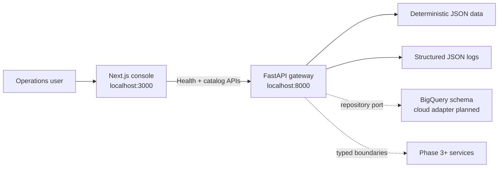

# GeoOps AI

GeoOps AI is a geospatial AI operations platform for field-service teams. The planned system combines structured operational data, geospatial reasoning, enterprise knowledge retrieval, typed agent tools, human approval, asynchronous dispatch, and reproducible evaluation.

The current implementation includes the platform foundation and the Phase 2 domain/data slice: a tested Next.js operations console, a typed FastAPI gateway, deterministic operational records, repository abstractions, and BigQuery schema definitions. It does not display invented performance metrics.

## Current capabilities

- Responsive and accessible operations console
- Live browser-to-API health verification with loading, error, retry, and success states
- Searchable and filterable ticket and technician catalogs with detail views
- Typed customer, site, ticket, assignment, certification, SLA, approval, agent, evaluation, and knowledge entities
- Deterministic seed data with dispatch edge cases and referential-integrity tests
- Storage-neutral repository boundary with a local JSON implementation
- BigQuery DDL with practical partitioning and clustering
- Typed, deterministic `GET /health` API contract and generated OpenAPI documentation
- Validated environment configuration with safe local defaults
- Configurable CORS for local browser access
- Correlation IDs and structured JSON request logs
- pnpm and uv workspaces with committed lockfiles
- Unit tests, linting, strict type checking, and optimized builds
- Development and deployable container targets

## Architecture



The browser calls the API directly, exercising the real cross-origin application boundary. Application services depend on repository protocols rather than storage SDKs; local mode reads a deterministic JSON snapshot, while a future BigQuery adapter can implement the same contracts without changing API or UI behavior.

## Repository layout

```text
.
├── apps/
│   ├── api/              # FastAPI package, tests, and container
│   └── web/              # Next.js application, tests, and container
├── data/
│   ├── seed/             # Deterministic operational snapshot
│   └── schema/           # BigQuery DDL migrations
├── .env.example          # Canonical local configuration contract
├── docker-compose.yml    # Hot-reloading local container stack
├── Makefile              # Developer workflow
├── package.json          # pnpm orchestration scripts
├── pnpm-workspace.yaml
└── pyproject.toml        # uv workspace and Python tooling
```

Worker, agent, evaluation, and infrastructure directories will be introduced only when their implementation phase begins.

## Prerequisites

- Node.js 22 or newer; Node 24 LTS is the container baseline
- pnpm 10.29.3
- Python 3.13
- [uv](https://docs.astral.sh/uv/)
- GNU Make or a compatible `make`
- Docker with Compose v2 only if using the container workflow

## Local setup

```bash
cp .env.example .env
make setup
make seed
make dev
```

Open:

- Web console: <http://localhost:3000>
- API health: <http://localhost:8000/health>
- OpenAPI documentation: <http://localhost:8000/docs>

`make dev` runs both applications with hot reload. Use `Ctrl+C` once to stop both processes.

If `make` is unavailable, run the underlying cross-platform commands directly:

```bash
pnpm install
uv sync --all-packages
uv run --package geoops-api python -m geoops_api.seed
pnpm dev
```

Run either application independently with:

```bash
make web
make api
```

## Configuration

| Variable | Default | Purpose |
| --- | --- | --- |
| `APP_ENV` | `development` | API environment label returned by `/health` |
| `LOG_LEVEL` | `INFO` | Python structured-log threshold |
| `CORS_ORIGINS` | Local web origins | JSON array of allowed browser origins |
| `HOST` | `0.0.0.0` | API bind host for local tooling and containers |
| `PORT` | `8000` | API port |
| `SEED_DATA_PATH` | `data/seed/geoops_seed.json` | Local operational dataset |
| `NEXT_PUBLIC_API_BASE_URL` | `http://localhost:8000` | Browser-visible API origin |

Values prefixed with `NEXT_PUBLIC_` are embedded in browser assets and must never contain secrets.

## Quality checks

```bash
make lint
make typecheck
make test
make build
```

To format supported source files:

```bash
make format
```

The API test suite covers health and catalog contracts, seed-data integrity, environment overrides, CORS preflight, correlation IDs, filtering, pagination, and unknown records. The web suite covers health loading, success, failure, and retry states plus ticket and technician catalog rendering.

## Operational catalog

The local dataset is anchored to a fixed reference time so SLA and certification edge cases remain reproducible. Regenerate the committed snapshot with `make seed`.

| Endpoint | Purpose |
| --- | --- |
| `GET /api/tickets` | Paginated ticket search with status and priority filters |
| `GET /api/tickets/{id}` | Ticket, customer, site, SLA, and assignment detail |
| `GET /api/technicians` | Technician search with availability and certification filters |
| `GET /api/technicians/{id}` | Technician qualifications, performance, and schedule detail |

See [the data model](docs/data-model.md) for relationships, edge cases, and storage responsibilities.

## Containers

Start the hot-reloading Compose stack:

```bash
make docker
```

Build the deployable targets directly:

```bash
docker build -f apps/api/Dockerfile --target production -t geoops-api:local .
docker build -f apps/web/Dockerfile --target production -t geoops-web:local .
```

Both runtime images use non-root users and include health checks. The web build defaults to `http://localhost:8000` for its browser-visible API URL; override `NEXT_PUBLIC_API_BASE_URL` as a build argument for deployed environments.

## HTTP contract

`GET /health` returns HTTP 200 while the API process is healthy:

```json
{
  "status": "ok",
  "service": "geoops-api",
  "environment": "development",
  "version": "0.1.0"
}
```

Every response includes `X-Request-ID`. A caller-supplied ID is propagated; otherwise the API generates one. Request telemetry is emitted as structured JSON without credentials or request bodies.

## Engineering decisions

- **pnpm + uv:** fast, deterministic, language-appropriate workspaces without hiding commands behind a custom task runner.
- **Direct health call:** verifies the browser/API boundary and CORS behavior rather than masking it behind a Next.js proxy.
- **Application factory:** FastAPI construction accepts explicit settings, keeping tests deterministic and future dependency injection straightforward.
- **Repository ports:** application services consume provider-neutral interfaces; JSON is a local adapter rather than a business-logic dependency.
- **Fixed seed clock:** synthetic SLA and certification scenarios remain stable across machines and CI runs.
- **No empty architecture:** services and cloud resources arrive in the phase that needs them, avoiding unused abstractions.
- **No fake dashboard metrics:** the console reports service state and records derived from the deterministic operational dataset.
- **Local-first:** no cloud project, credentials, model key, or hosted deployment is required for the current implementation.

## Roadmap

1. **Foundation — complete:** web, API, configuration, tests, containers, local workflow.
2. **Domain and data — complete:** typed entities, repository boundaries, deterministic seed data, BigQuery DDL, ticket and technician browsing.
3. **Deterministic dispatch:** eligibility rules and explainable candidate scoring.
4. **Maps:** mock and Google Maps provider adapters with route matrices.
5. **Knowledge retrieval:** ingestion, chunking, embeddings, BigQuery vector search, citations.
6. **Agent orchestration:** typed tools and provider-neutral Gemini/ADK integration.
7. **Human approval:** explicit mutation proposals and approval state machine.
8. **Async dispatch:** event bus, idempotent worker, and operational updates.
9. **Evaluation:** reproducible datasets, quality metrics, and regression gates.
10. **Observability, infrastructure, and CI/CD:** cloud telemetry, Terraform, and deployment automation.
