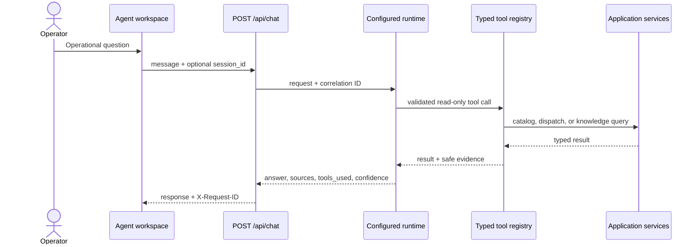

# Agent orchestration

Phase 6 adds an operations assistant without giving a model direct repository or mutation access. The same strict tool registry serves the deterministic local runtime and the Google Agent Development Kit adapter.

## Request path

## Runtime selection

- `MODEL_PROVIDER=local` uses `geoops-local-planner-v1`. It is deterministic, key-free, and is the default for tests and local development.
- `MODEL_PROVIDER=gemini_api` uses Google ADK with the Gemini Developer API. Set `GEMINI_API_KEY` and a supported Gemini `MODEL_NAME`.
- `MODEL_PROVIDER=vertex_ai` uses the same ADK adapter with Vertex AI. Configure Application Default Credentials, `GOOGLE_CLOUD_PROJECT`, `GOOGLE_CLOUD_LOCATION`, and a supported model name.

Provider credentials stay in the API process. The browser receives the provider and model labels, never secrets.

## Tool boundary

The Phase 6 registry exposes these operations:

- `get_ticket`
- `search_tickets`
- `get_technician`
- `search_technicians`
- `recommend_assignment`
- `search_knowledge`

Every input is validated with a strict Pydantic model. Tool calls flow through application services instead of raw storage. Each completed call records the trace, session, agent run, tool name, latency, retrieval count, and success state.

There is intentionally no assignment, approval, status-update, or generic query tool. A mutation request is reported as requiring approval, but Phase 6 cannot create or execute an approval.

## Response safety

`POST /api/chat` returns an answer plus optional structured recommendation, citations, tools used, confidence, approval requirement, and correlation identifiers. This is operator-facing evidence, not model chain-of-thought. Route estimates remain labeled as estimates, and the local runtime never claims that a recommendation changed operational state.
