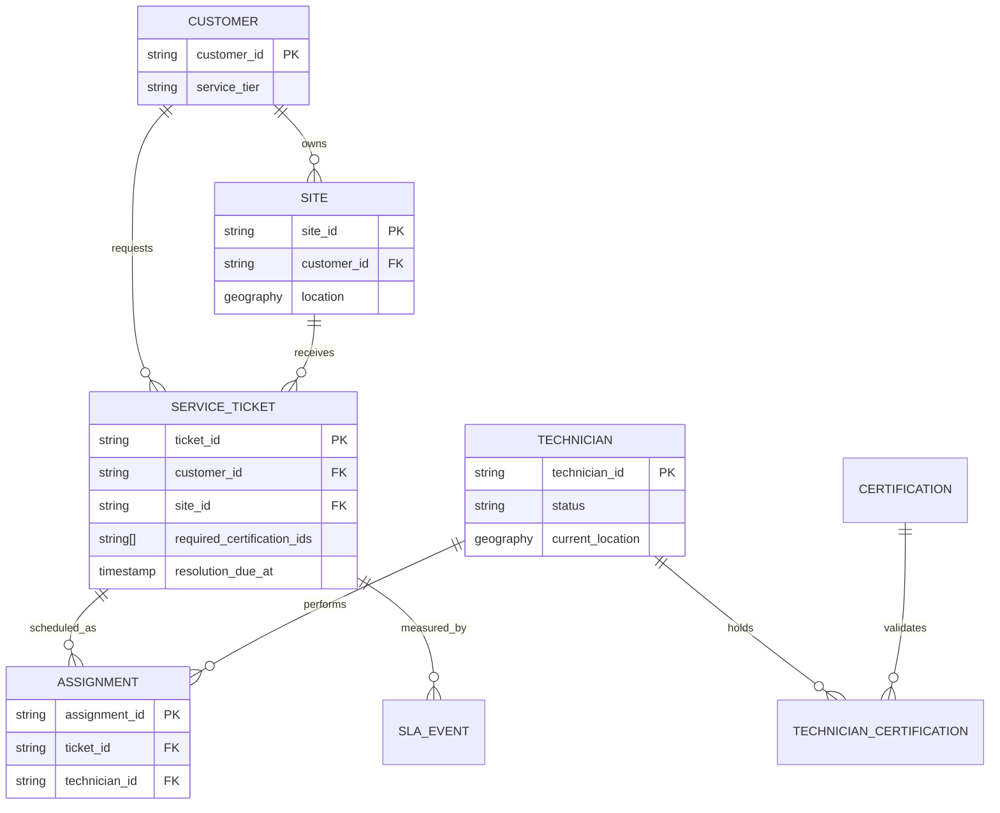

# GeoOps data model

Phase 2 separates application behavior from persistence. Domain entities and repository protocols are provider-neutral; local mode loads a deterministic JSON snapshot, and the BigQuery DDL describes the analytical/historical target.

## Relationships



## Storage responsibilities

- Local mode reads `data/seed/geoops_seed.json` through `JsonCatalogRepository`.
- BigQuery is the planned analytical and historical store for structured business data, event history, evaluation results, and knowledge chunks.
- Firestore is reserved for short-lived sessions, approvals, agent state, and tool execution state; those operational collections arrive with the relevant workflow phases.
- The API never exposes a storage SDK. Routes call application services, which call the `CatalogRepository` protocol.

## Deterministic scenarios

The generator uses a fixed UTC reference time and stable source records. It includes:

- a ticket requiring an elevator certification held by no technician;
- a remote generator job with qualified technicians far from the site;
- overlapping active assignments for one technician;
- certifications expiring within 30 days;
- breached SLA deadlines;
- a site with an invalid address;
- a site configured to simulate route-provider failure;
- an unavailable technician.

Regenerate and validate the snapshot with:

```bash
make seed
make test
```

