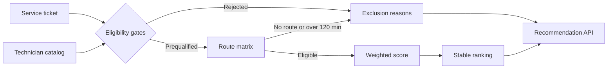

# Deterministic dispatch policy

The dispatch service ranks technicians only after mandatory eligibility and routing checks succeed. It is a read-only decision-support workflow: it does not create or change assignments.

## Evaluation sequence

The policy evaluates the committed dataset's fixed reference time. The proposed service window starts one hour later and lasts four hours, which keeps results reproducible across machines and test runs.

## Hard eligibility gates

A technician is excluded when any of these conditions apply:

- status is not `available`;
- a required certification is missing;
- a required certification expires before the proposed service window;
- an active or scheduled assignment overlaps the proposed window;
- the site does not have valid coordinates;
- straight-line distance exceeds the 65 km matrix prefilter;
- the configured provider cannot return a route; or
- route duration exceeds 120 minutes.

All applicable reasons are returned. The policy never relaxes a hard gate to manufacture a recommendation.

## Score

Only eligible candidates receive a score. The maximum is 100 points:

| Factor                 | Maximum | Calculation                                            |
| ---------------------- | ------: | ------------------------------------------------------ |
| Required certification |      25 | Full credit after the certification gate passes        |
| Travel time            |      30 | Linear decay from 0 to the 120-minute route limit      |
| Current workload       |      20 | Linear penalty through three active/future assignments |
| Historical rating      |      15 | Rating normalized against 5.0                          |
| Experience             |      10 | Completed jobs normalized at 200 jobs                  |

Candidates are ordered by score descending, then route duration ascending, then technician ID. This makes ties stable and auditable.

## Current boundary

The default mock provider multiplies Haversine distance by a fixed road factor and applies a fixed average speed. Its output is deterministic and explicitly marked as an estimate. The Google adapter uses Geocoding v4 and Routes v2 only when configured with a server-side API key. Provider failure produces an auditable `route_unavailable` exclusion rather than silently falling back to straight-line scoring.

Phase 7 can snapshot a qualifying recommendation into a human approval proposal. Approval does not mutate the assignment; event publication and execution remain Phase 8 responsibilities.
