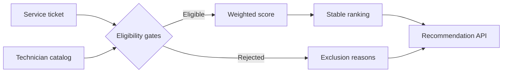

# Deterministic dispatch policy

Phase 3 ranks technicians only after mandatory eligibility checks succeed. It is a read-only decision-support workflow: it does not create or change assignments.

## Evaluation sequence

The policy evaluates the committed dataset's fixed reference time. The proposed service window starts one hour later and lasts four hours, which keeps results reproducible across machines and test runs.

## Hard eligibility gates

A technician is excluded when any of these conditions apply:

- status is not `available`;
- a required certification is missing;
- a required certification expires before the proposed service window;
- an active or scheduled assignment overlaps the proposed window;
- the site does not have valid coordinates;
- straight-line distance exceeds the 65 km local service radius.

All applicable reasons are returned. The policy never relaxes a hard gate to manufacture a recommendation.

## Score

Only eligible candidates receive a score. The maximum is 100 points:

| Factor | Maximum | Calculation |
| --- | ---: | --- |
| Required certification | 25 | Full credit after the certification gate passes |
| Proximity | 30 | Linear decay from 0 km to the 65 km service radius |
| Current workload | 20 | Linear penalty through three active/future assignments |
| Historical rating | 15 | Rating normalized against 5.0 |
| Experience | 10 | Completed jobs normalized at 200 jobs |

Candidates are ordered by score descending, then distance ascending, then technician ID. This makes ties stable and auditable.

## Current boundary

Distance is calculated with the Haversine formula and is clearly labeled as a straight-line estimate. Phase 4 will introduce mock and Google Maps provider adapters for route time and route-matrix evidence without changing the hard certification, availability, or schedule gates.

Assignment mutations remain out of scope until the approval workflow is implemented.
