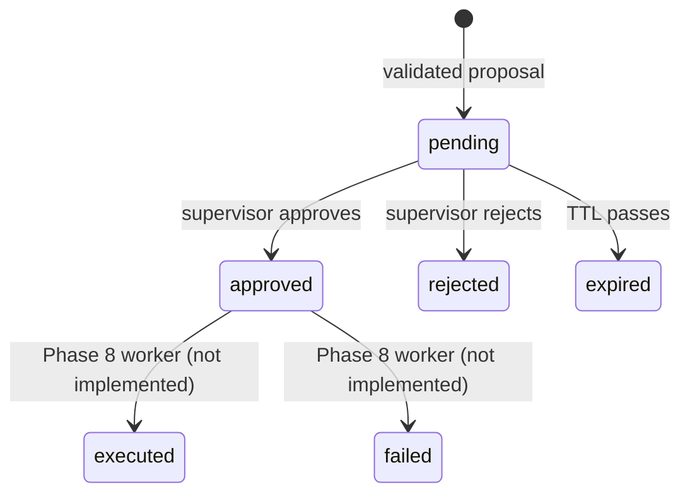

# Human approval

Phase 7 introduces an explicit control boundary between an agent recommendation and an operational assignment change. It creates and decides proposals only. Approved proposals are not executed until the Phase 8 event and worker path exists.

## State machine

Only `pending` proposals can transition in Phase 7. Repeating the same approve or reject decision is idempotent. Attempting the opposite decision or deciding an expired proposal returns a conflict. Repository compare-and-set operations keep this rule atomic across concurrent requests.

## Proposal validation

Before persistence, the service verifies that:

1. the ticket and target technician exist;
2. the ticket is dispatchable;
3. the target passes every deterministic certification, availability, schedule, geography, and route gate;
4. the target is not already assigned;
5. no equivalent pending proposal already exists.

The stored evidence snapshots the dispatch policy version, score, matched certifications, distance, travel time, provider, and estimate label used when the proposal was created.

## Storage

`APPROVAL_STORE=memory` is the key-free local default and persists for the API process lifetime. `APPROVAL_STORE=firestore` selects the asynchronous Firestore adapter and requires `GOOGLE_CLOUD_PROJECT` plus Application Default Credentials. Firestore holds short-lived operational state; historical dispatch events remain a BigQuery responsibility in later phases.

Firestore decisions use a transaction that reads the current document and writes only when its status is still `pending`. This is the persistent equivalent of the lock-protected compare-and-set used by the local repository.

## Security boundary

Agent mutation language is handled by a deterministic policy path. It resolves the named technician, invokes `request_dispatch_approval`, and returns the approval ID. Neither the model nor the approval endpoint has an assignment-write capability. The reviewer identity is explicit request data until an authentication phase supplies verified principals.
