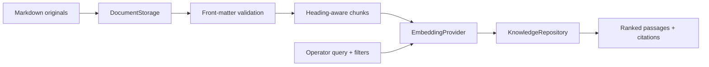

# Knowledge retrieval

Phase 5 provides a deterministic retrieval layer over versioned enterprise documents. It returns evidence, not a generated answer. Every result contains the source document, section, version, storage path, similarity score, and display-ready citation.

## Pipeline

Local mode uses `FilesystemDocumentStorage`, `DeterministicEmbeddingProvider`, and `InMemoryKnowledgeRepository`. These adapters are key-free and deterministic. The interfaces separate source storage, embeddings, and vector retrieval so Cloud Storage, a managed embedding model, or BigQuery can be introduced without changing API handlers.

## Source format

Originals live under `data/documents` in category directories. Each Markdown file starts with flat front matter containing:

- `document_id`, `title`, `document_type`, and `version`;
- optional `effective_date`, `customer_id`, and `equipment_type`; and
- additional metadata retained with every chunk.

Ingestion rejects missing metadata, invalid dates or document types, duplicate IDs, empty documents, and paths outside the configured root. Chunk IDs are content-derived and stable.

## Search and filters

`POST /api/knowledge/search` accepts a query plus optional customer, equipment, document-type, and effective-date filters. Filters run before ranking. The response never fabricates a narrative when nothing matches; it returns an empty `sources` array.

The local provider creates normalized 256-dimensional hashing vectors over tokens and adjacent token pairs. Cosine similarity produces stable rankings for tests and local workflows. These vectors are deliberately labeled as a development implementation and are not claimed to match a managed semantic model.

## BigQuery path

The existing `knowledge_chunks` table stores `ARRAY<FLOAT64>` embeddings and filter metadata. `data/schema/002_knowledge_vector_index.sql` defines an IVF cosine index with stored filter columns. `data/schema/knowledge_vector_search.sql` provides the parameterized metadata-prefiltered query using BigQuery [`VECTOR_SEARCH`](https://docs.cloud.google.com/bigquery/docs/reference/standard-sql/search_functions#vector_search). BigQuery can use brute force before an index is populated; the optional index accelerates larger collections according to the [vector-index guidance](https://docs.cloud.google.com/bigquery/docs/vector-index).

## Current boundary

No language model is invoked in this phase. Combining ticket data, dispatch evidence, routes, and retrieved passages belongs to the typed agent/tool layer in Phase 6. This boundary keeps unsupported claims out of the knowledge API and makes citation correctness independently testable.
